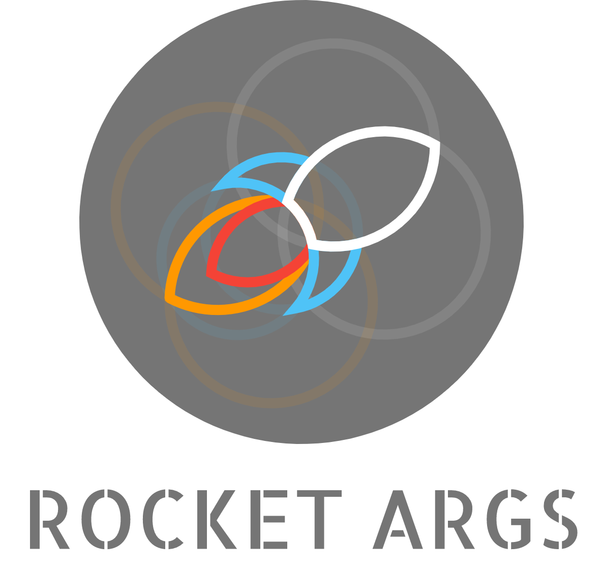

    
    <b>Make your arg parsing even more declarative!</b>

* Free software: MIT license
* Documentation: https://rocket-args.readthedocs.io.

## Features

* TODO

## Credits

This package was created with [Cookiecutter](https://github.com/audreyr/cookiecutter) and the
[audreyr/cookiecutter-pypackage](https://github.com/audreyr/cookiecutter-pypackage) project template.
